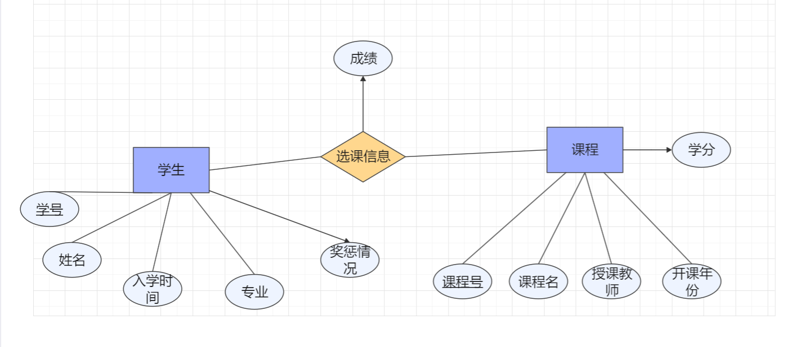

# 学籍管理系统设计报告

# 前期设计

### 需求分析

计划实现一个学籍管理系统

##### 数据需求

* 学生信息：包括学号、姓名、入学时间、专业、奖惩情况

其中学号是定长字符串

姓名是变长字符串

入学时间是日期类型的字符串

专业是变长字符串

奖惩情况是int类型整数，代表奖励次数-受惩罚次数

* 选课信息：包括学生学号、课程号、成绩

成绩是一个0-100的整数

* 课程信息：包括课程号、课程名、授课教师、开课年份、学分

课程号是定长字符串

课程名是变长字符串

授课教师是变长字符串

开课年份是一个日期类型的字符串

学分是一个整数

##### 功能需求

1.可以在前端增加学生信息

2.可以在前端增加课程信息

3.可以在前端增加选课信息，要求学生和课程均已存在

4.可以修改学生课程成绩

5.可以修改学生专业

6.可以修改学生奖惩信息

7.可以查询GPA

### 概念设计：ER图

### 逻辑设计

设计关系模式如下

1.学生(<u>学号</u>，姓名，入学时间，专业，奖惩情况)

2.课程(<u>课程号</u>，课程名，授课教师，开课年份，学分)

3.选课表(<u>学号</u>，<u>课程号</u>，成绩)

以上关系模式的设计符合3NF

## 实现说明

## 结果展示